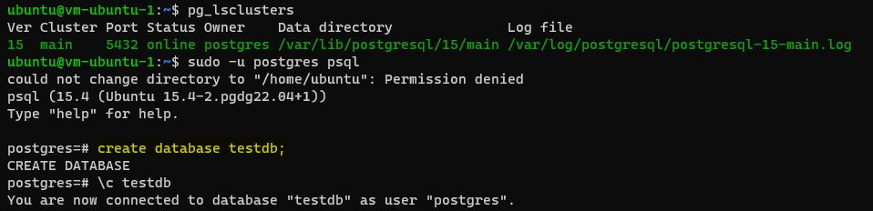
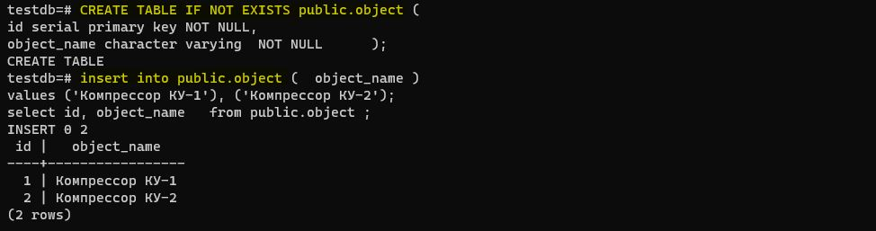
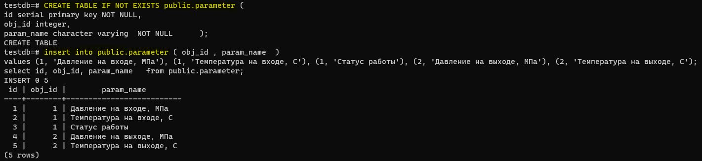
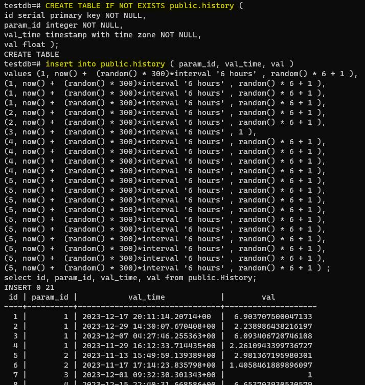
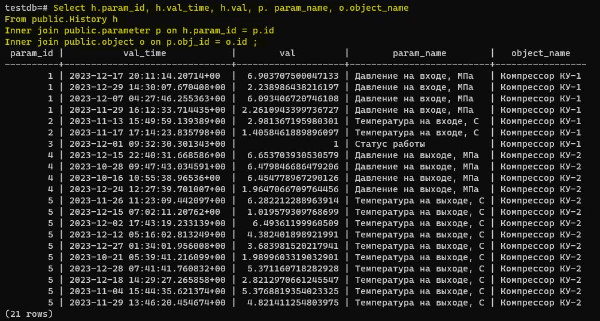
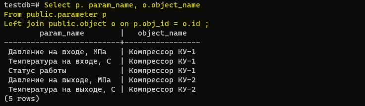
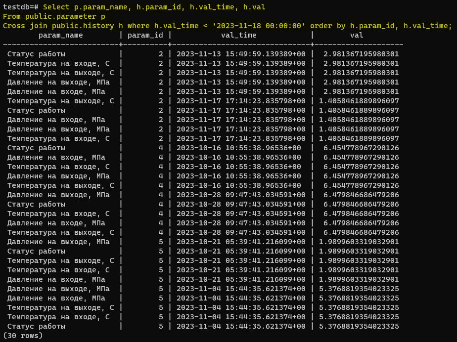
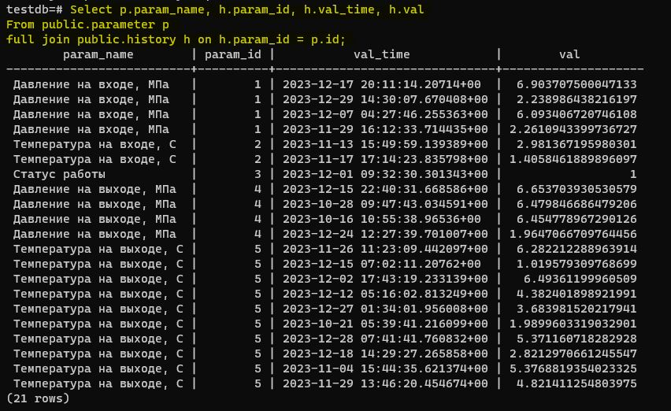
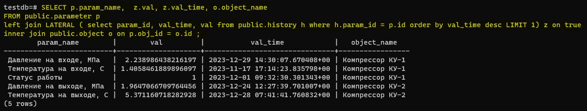

# Домашнее задание №13 (Тема "Сбор и использование статистики")

* Реализовать прямое соединение двух или более таблиц
  
* Реализовать левостороннее (или правостороннее) соединение двух или более таблиц
  
* Реализовать кросс соединение двух или более таблиц
  
* Реализовать полное соединение двух или более таблиц
  
* Реализовать запрос, в котором будут использованы разные типы соединений
  
* Сделать комментарии на каждый запрос
* К работе приложить структуру таблиц, для которых выполнялись соединения

  <pre>

Структура таблицы object

  CREATE TABLE IF NOT EXISTS public.object (
  id serial primary key NOT NULL,
  object_name character varying  NOT NULL      );
  
</pre>

  <pre>

Структура таблицы parameter

  CREATE TABLE IF NOT EXISTS public.parameter (
  id serial primary key NOT NULL,
  obj_id integer,
  param_name character varying  NOT NULL      );
  
</pre>

  <pre>

Структура таблицы history

  CREATE TABLE IF NOT EXISTS public.history (
  id serial primary key NOT NULL,
  param_id integer NOT NULL,
  val_time timestamp with time zone NOT NULL,
  val float );
  
</pre>

  

